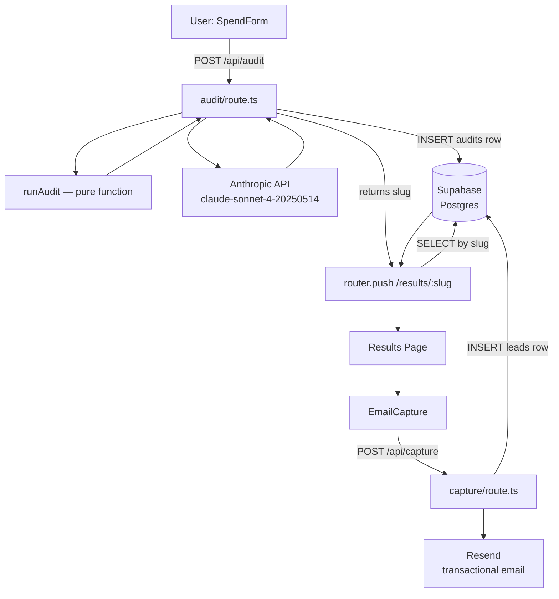

# Architecture

## System Diagram

---

## Data Flow — step by step

1. **User fills SpendForm** — selects tool, plan, seat count, use case, and monthly spend for each AI tool. Form state is persisted to `localStorage` so a page refresh does not lose data.

2. **POST /api/audit** — `SpendForm` sends `toolInputs: ToolInput[]` to the audit API route. The route validates the array is non-empty, then calls `runAudit()`.

3. **runAudit() — pure function** — takes the tool inputs, applies 4 rules (seat-count downgrade, redundancy detection, overpay vs API, already optimal), and returns an `AuditOutput` object. No database calls, no API calls. This is the core logic of the product.

4. **Anthropic summary** — the audit route calls `generateSummary()`, which sends the tool results to `claude-sonnet-4-20250514` and gets back one paragraph. If the Anthropic call fails, a fallback template is used so the audit never errors out for the user.

5. **Supabase INSERT** — the audit route saves a row to the `audits` table: slug, tool_inputs (JSON), audit_results (JSON), ai_summary, and the denormalized savings totals. The slug is generated with `nanoid(8)`.

6. **Slug returned** — the API response contains the slug. The frontend redirects to `/results/[slug]`.

7. **Results page fetch** — `app/results/[slug]/page.tsx` is a Next.js Server Component. It queries Supabase for the audit row matching the slug. If not found it calls `notFound()`.

8. **Results page renders** — `SavingsHero` (total savings), per-tool `ToolBreakdown` cards, AI summary paragraph, and `EmailCapture` form are rendered from the fetched data.

9. **Email capture** — if the user submits their email, `POST /api/capture` saves a row to the `leads` table and fires a transactional email via Resend from `onboarding@resend.dev`.

---

## Database Schema

**audits**
| column | type | notes |
|--------|------|-------|
| id | uuid | primary key, default gen_random_uuid() |
| slug | text | unique, 8-char nanoid |
| tool_inputs | jsonb | array of ToolInput |
| audit_results | jsonb | AuditOutput object |
| ai_summary | text | nullable, Anthropic output |
| total_monthly_savings | numeric | denormalized for quick queries |
| total_annual_savings | numeric | denormalized |
| created_at | timestamptz | default now() |

**leads**
| column | type | notes |
|--------|------|-------|
| id | uuid | primary key |
| audit_id | uuid | foreign key → audits.id |
| email | text | |
| company_name | text | nullable |
| role | text | nullable |
| team_size | text | nullable |
| created_at | timestamptz | default now() |

---

## Key Design Decisions

**Pure function for audit engine**
`runAudit()` takes inputs and returns outputs with no side effects. This was a deliberate choice made on Day 3 before writing a single line of audit logic. The consequence: all 5 tests were written without any mocking, stubbing, or test database setup. The same function runs identically in tests, in the API route, and could run in the browser. If the audit logic had been embedded inside the API route (mixed with database calls), testing it would have required mocking Supabase — a layer of indirection that hides real bugs.

**nanoid(8) for shareable slugs**
8 characters from a 64-character alphabet gives 64^8 = ~281 trillion unique values. Collision probability is negligible at any traffic level realistic for this product — the Supabase `UNIQUE` constraint on the `slug` column is the real safety net if one ever occurs. The slug is what makes results shareable without authentication — a user can send the URL to their team or investor without creating an account. UUID was considered but is visually unwieldy in a URL (`/results/550e8400-e29b-41d4-a716-446655440000`). An 8-char slug (`/results/jEYlm6AP`) is short enough to share in a Slack message.

**Anthropic client initialized inside the function, not at module level**
Next.js App Router evaluates module-level code at build time, not at runtime. An `Anthropic` client initialized at the top of a route file reads `process.env.ANTHROPIC_API_KEY` during the build — before the environment variables from `.env.local` or Vercel are injected. This threw a "Missing credentials" error in production even though the key was correctly set. Moving the client initialization inside `generateSummary()` ensures it reads the environment at request time. This was a real bug that took an hour to diagnose on Day 5.

**In-memory rate limiting on /api/capture**
The email capture route uses a `Map<ip, timestamps[]>` to limit each IP to 5 submissions per hour. This is intentionally simple — it resets when the serverless function cold-starts and does not persist across Vercel instances. A production-grade solution would use Redis (e.g. Upstash) or a Supabase rate-limit table. The in-memory approach was chosen because it costs nothing, requires no additional service, and is sufficient at the current scale. The honeypot field (hidden `website` input) provides a complementary layer against automated submissions.

**Supabase over MongoDB**
The data has a clear relational structure: every `lead` belongs to exactly one `audit`. Supabase's Postgres also provides JSONB columns for the tool inputs and audit results — flexible enough to store the entire structured JSON without a rigid schema, while still being queryable. Row-Level Security was available but disabled for the MVP because there is no user authentication — all reads are by slug only, and the slug space is large enough to serve as a weak access control.

**No authentication**
Results are public by slug. Anyone with the link can view the results. This was a deliberate product decision: requiring signup before seeing results would kill conversion (both interviews confirmed email-before-value is a trust killer). The slug is the access token. The tradeoff is that results are not private — but for an AI spend audit the sensitivity is low, and the shareable URL is a feature (founder sends it to their CTO).
