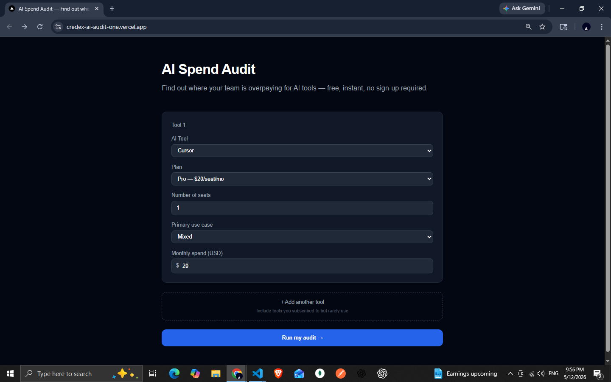
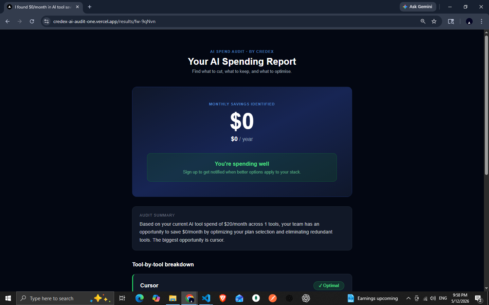

# AI Spend Audit

A free web tool for startup founders and engineering managers to audit their AI tool spending, find redundancies, and get instant savings recommendations — no signup required.

**Live:** https://credex-ai-audit-one.vercel.app

Built for Credex — [credex.rocks](https://credex.rocks)

---

## What it does

1. Enter your AI tools — name, plan, seat count, use case, monthly spend
2. Get an instant audit: where you're overspending, what to cut, estimated savings
3. Receive an AI-written summary paragraph explaining the findings
4. Share via a unique public URL (no login required)
5. Optionally leave your email — Credex follows up if savings exceed $500/month

---

## Screenshots

_Form page — enter your tools_



_Results page — savings breakdown_



_Video walkthrough (30 seconds): form → audit → results page_

🎥 [Watch on Loom](https://www.loom.com/share/a9cfecae1bbd45689f9eaa8f607e0f12)

---

## Tech Stack

| Layer | Choice |
|-------|--------|
| Framework | Next.js 14 (App Router) |
| Language | TypeScript (strict mode) |
| Styling | Tailwind CSS |
| Database | Supabase (Postgres + JSONB) |
| Email | Resend |
| AI | Anthropic API (`claude-sonnet-4-20250514`) |
| Deployment | Vercel |
| CI/CD | GitHub Actions |
| Tests | Vitest |

---

## Getting Started

```bash
npm install
cp .env.example .env.local
# Fill in your environment variables (see below)
npm run dev
```

Open [http://localhost:3000](http://localhost:3000).

## Environment Variables

```
ANTHROPIC_API_KEY=        # Anthropic console
SUPABASE_URL=             # Supabase project settings → API
SUPABASE_ANON_KEY=        # Supabase project settings → API
RESEND_API_KEY=           # Resend dashboard
NEXT_PUBLIC_BASE_URL=     # http://localhost:3000 locally, your Vercel URL in production
```

Never commit these values. `.env.local` is in `.gitignore`.

## Running Tests

```bash
npm test
```

5 tests, all passing. Tests cover the audit engine only — see `TESTS.md` for what's tested and why.

---

## Folder Structure

```
/app
  page.tsx                     → Landing page, renders SpendForm
  results/[slug]/page.tsx      → Public shareable result page (Server Component)
  api/audit/route.ts           → Runs audit engine, calls Anthropic, saves to Supabase, returns slug
  api/capture/route.ts         → Saves email lead, sends Resend confirmation email

/lib
  audit-engine.ts              → Pure audit logic — no API calls, fully testable
  pricing-data.ts              → Hardcoded pricing for 8 AI tools
  supabase.ts                  → Supabase client
  resend.ts                    → Resend client

/components
  SpendForm.tsx                → Multi-tool input form with localStorage persistence
  SavingsHero.tsx              → Total savings callout with conditional CTAs
  ToolBreakdown.tsx            → Per-tool recommendation cards
  EmailCapture.tsx             → Optional email form with honeypot + rate limiting

/types
  index.ts                     → All TypeScript interfaces

/__tests__
  audit-engine.test.ts         → Vitest tests for audit logic
```

---

## Key Decisions

**Audit engine as a pure function** — `runAudit()` has no side effects. It takes `ToolInput[]` and returns `AuditOutput`. This made all 5 tests writable without mocking anything. Full explanation in `ARCHITECTURE.md`.

**Shareable URL without authentication** — results are public by slug (`nanoid(8)`, ~281 trillion possible values). No account required to share. This was validated by user interviews — both Sinan (founder) and Dharaneesh (developer) described leaving tools that required signup before showing value.

**Anthropic client initialized at request time, not module level** — Next.js reads module-level code at build time before environment variables are available. Initializing the client inside the function body reads the key at runtime. This was a real production bug discovered on Day 5.

**Email capture after results, never before** — all three user interviews independently mentioned abandoning tools that gated results behind an email form. The current design shows the full audit first; email is optional and appears below the results.

**OpenAI → Anthropic API switch mid-build** — the summary paragraph was initially prototyped using OpenAI `gpt-4o-mini` due to existing API access. Switched to Anthropic `claude-sonnet-4-20250514` on Day 5 because Credex is an Anthropic-aligned company and the assignment explicitly favoured Anthropic API usage. Required reverting two commits with `git reset HEAD~2` and rewriting the API route. Documented in DEVLOG Day 5.

---

## Known Limitations

- Resend sender domain (`onboarding@resend.dev`) is the development default — a custom verified domain (`noreply@credex.rocks`) is needed before production launch
- Rate limiting on `/api/capture` is in-memory and resets on cold start — fine for current scale, would need Redis for higher traffic
- Audit rules are based on hardcoded pricing data last verified in May 2026 — prices change and would need a refresh pipeline in production
